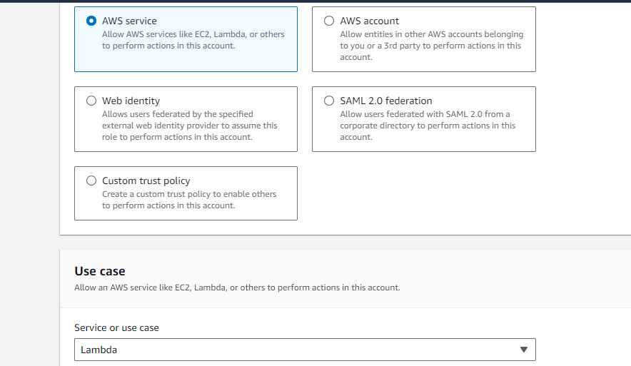
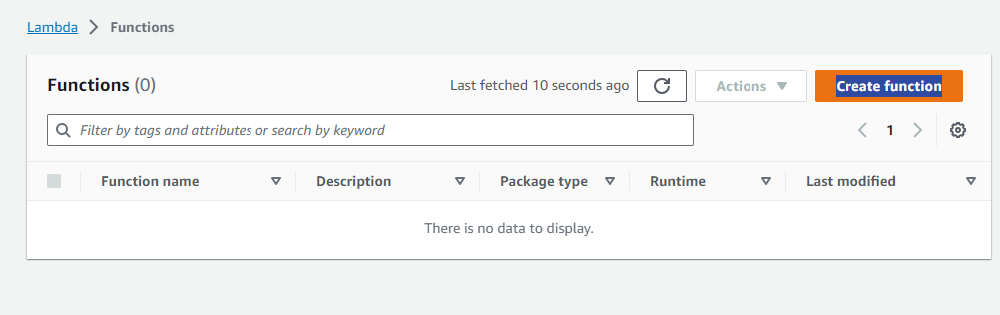
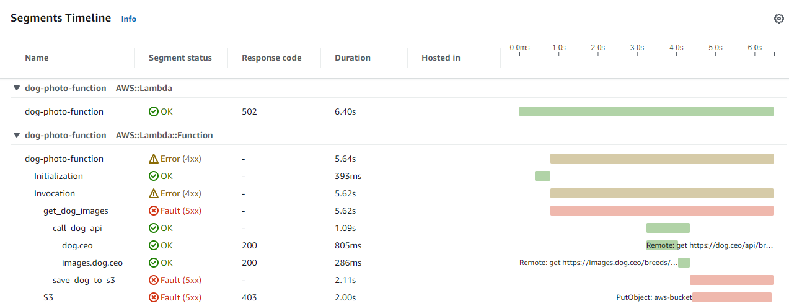

# Lambda X-Ray Project

## Overview

This project guides you through the creation of a Lambda function that can be invoked via a Function URL. This function queries a Dog photo API, saves the retrieved image to an S3 bucket, and displays the image in the browser.

The Dog API utilized in this project is available at [https://dog.ceo/dog-api/](https://dog.ceo/dog-api/).

To enhance performance monitoring, Lambda X-Ray is integrated to identify potential bottlenecks or errors in the code.

Before you begin, download the `function.zip` file from this repository. There's no need to unzip it unless you wish to inspect its contents; it will be uploaded to Lambda as is.

The setup for this environment will be in the us-east-1 region, and all console links provided will be specific to that region. Ensure that you adjust the region accordingly if deploying elsewhere.

## Instructions

### Stage 1 - Create Dog Photo Bucket

1. Navigate to the S3 console: [https://s3.console.aws.amazon.com/s3/buckets](https://s3.console.aws.amazon.com/s3/buckets?region=us-east-1).
2. Click on *Buckets* and then select <kbd>Create bucket</kbd>.


3. Name the bucket `lovely-dogs`. Keep in mind that bucket names are regionally unique, so your preferred name may be taken. Feel free to choose any unique name.
4. Click <kbd>Create bucket</kbd>.

## Stage 2 - Lambda IAM Role Creation

Navigate to the AWS Identity and Access Management (IAM) console by visiting [https://us-east-1.console.aws.amazon.com/iam/home?region=us-east-1#/roles](https://us-east-1.console.aws.amazon.com/iam/home?region=us-east-1#/roles).

1. Click on *Roles*, and then select <kbd>Create role</kbd>.


2. Set the trusted identity to "AWS Service" and choose "Lambda".



3. Click <kbd>Next</kbd>.

4. On the "Add permissions" page, search for and select `AmazonS3FullAccess`.


5. Also, search for and select `CloudWatchFullAccess`.


Please note that in a production environment, it is recommended to restrict these permissions further, such as to a specific bucket with specific actions.

6. Click <kbd>Next</kbd>.

7. Set the *Role name* to `dog-photo-function-role`.

8. Click <kbd>Create role</kbd>.

## Stage 3 - Lambda Function Creation

### Instructions:

1. Navigate to the Lambda console: [https://us-east-1.console.aws.amazon.com/lambda/](https://us-east-1.console.aws.amazon.com/lambda/)

2. Click on *Functions*, then select <kbd>Create function</kbd>

   

3. Set the *Function name* to `dog-photo-function`

4. Change the *Runtime* to “Python 3.9” (or the latest available Python version)

   

5. Under *Permissions*, expand the “Change default execution role” pane, and select “Use an existing role”.

   Search for and select the role created in the previous step.

   

6. Click <kbd>Create function</kbd>

7. In the function page's *Code* tab, click <kbd>Upload from</kbd> and select <kbd>.zip file</kbd>

   

8. Click <kbd>Upload</kbd>, select the zip file downloaded earlier, and click <kbd>Save</kbd>

   

### Lambda Function Code:

```python
# Import necessary modules
import aws_xray_sdk.core
import boto3
import requests
import os
import base64
import io
import mimetypes

# Initialize the AWS X-Ray SDK
aws_xray_sdk.core.patch_all()

# Lambda function handler
def lambda_handler(event, context):
    # Start a new X-Ray segment
    with aws_xray_sdk.core.xray_recorder.capture('get_dog_images'):
        # Create an S3 client
        session = boto3.Session()
        s3 = session.resource('s3')
        bucket_name = os.getenv('BUCKET_NAME')

        # Call the Dog API
        with aws_xray_sdk.core.xray_recorder.capture('call_dog_api'):
            # Define the endpoint for the Dog API
            endpoint = 'https://dog.ceo/api/breeds/image/random'
            
            # Make a GET request to the Dog API
            response = requests.get(endpoint)
            
            # Get the image URL from the response
            image_url = response.json()['message']

            # Get the name of the image
            image_name = str(response.json()['message']).split('/')[-1]
            
            # Download the image from the URL
            image = requests.get(image_url, stream=True).content
            
        # Save the image data to S3
        with aws_xray_sdk.core.xray_recorder.capture('save_dog_to_s3'):
            contenttype = mimetypes.types_map['.' + image_name.split('.')[-1]]
            bucket = s3.Bucket(bucket_name)
            bucket.upload_fileobj(io.BytesIO(image), image_name, ExtraArgs={'ContentType': contenttype})
        
    # Generate a response with the image in the body
    response = {
        'statusCode': 200,
        'headers': {
            'Content-Type': 'image/jpeg'
        },
        'body': base64.b64encode(image),
        'isBase64Encoded': True
    }
    return response
```

### Additional Notes:

- The Dog API request is encapsulated in an X-Ray segment called `call_dog_api`, and the S3 upload is within a segment called `save_dog_to_s3` for future reference.

- Lambda requires packaging additional Python modules, including `aws_xray_sdk`, into a zip file: [https://docs.aws.amazon.com/lambda/latest/dg/python-package.html](https://docs.aws.amazon.com/lambda/latest/dg/python-package.html)

### Configuration:

1. *Configuration* tab > *Function URL* > <kbd>Create function URL</kbd>

   

2. Change *Auth type* to “NONE” on the next page and click <kbd>Save</kbd>

   

3. **Note:** Delete the function at the end of the demo to prevent unlimited public calls.

4. Retrieve the Function URL for later use.

   

5. *Configuration* tab > *Environment variables* > <kbd>Edit</kbd>

   Set `BUCKET_NAME` to the name of the S3 bucket created in stage 1.

   

   Click <kbd>Save</kbd>

6. *Configuration* tab > *Monitoring and operations tools* > <kbd>Edit</kbd>

   Enable “Active tracing” under *AWS X-Ray* and click <kbd>Save</kbd>

   

7. *Configuration* tab > *General configuration* > <kbd>Edit</kbd>

   Change *Timeout* to 0 min 15 sec. Adjust for longer Dog API response times.

   

   Click <kbd>Save</kbd>

## Stage 4: Function Testing

To validate the functionality of our Lambda function, follow the steps outlined below:

1. Navigate to the Lambda console: [https://us-east-1.console.aws.amazon.com/lambda/](https://us-east-1.console.aws.amazon.com/lambda/)
2. Click on *Functions* and select the Lambda function recently created.

   

3. Access the *Function URL* by clicking on it to open the function in your browser.

   

4. Verify that an appealing photo of a dog is displayed.

   

5. Confirm whether the photo has been successfully saved to our designated S3 bucket.

   - Go to the S3 console: [https://s3.console.aws.amazon.com/s3/buckets](https://s3.console.aws.amazon.com/s3/buckets?region=us-east-1)
   - Click on *Buckets* and select the bucket created in Stage 1.

   

6. In the bucket, locate an image. Select the image and click <kbd>Open</kbd>.

   

7. Verify that the opened image matches the one displayed in your browser.

   

By following these steps, you ensure the proper execution of the Lambda function and the successful storage of the dog photo in the designated S3 bucket.

## Stage 5 - Analyzing X-Ray Metrics

### Overview

To gain insights into the performance and behavior of your serverless function, you can leverage AWS CloudWatch and AWS X-Ray. Follow the steps below to view and analyze X-Ray metrics.

### CloudWatch Console

1. Head to the CloudWatch console: [https://us-east-1.console.aws.amazon.com/cloudwatch](https://us-east-1.console.aws.amazon.com/cloudwatch).
2. Navigate to *X-Ray traces* and select *Service map*.


### Service Map

The Service Map provides a visual representation of all the services and resources invoked by your function. Despite the potential complexity with numerous functions and service calls, this diagram simplifies the understanding of your basic function's workflow.

- Clicking on any resource reveals metrics such as latency, request count, faults, etc.


### Traces Page

1. Head to the *Traces* page for more detailed information.
2. Click on any trace at the bottom of the page, as each trace corresponds to a function execution.


### Trace Details

Now, click on one of the traces to delve into the specifics of each request through a waterfall-style diagram, offering a comprehensive view of request durations.


- Identify segments like `call_dog_api` to understand the function's performance. For instance, if this segment encompasses the code responsible for calling the Dog API, note its duration.

### Modifying the Function and Monitoring Changes

To observe the impact of changes in your function, follow these steps:

1. Go to the Lambda console: [https://us-east-1.console.aws.amazon.com/lambda/](https://us-east-1.console.aws.amazon.com/lambda/).
2. Navigate to *Functions* and select the `dog-photo-function` function.
3. Go to *Configuration* and then *Environment variables*. Click <kbd>Edit</kbd>.


4. Modify the `BUCKET_NAME` variable to a bucket without access, e.g., `aws-bucket`.
5. Click <kbd>Save</kbd>.

### Observing Errors in X-Ray

1. Visit your *Function URL* in the browser, and you should encounter an `Internal Server Error`.


2. Head back to the CloudWatch console: [https://us-east-1.console.aws.amazon.com/cloudwatch](https://us-east-1.console.aws.amazon.com/cloudwatch).
3. Navigate to *X-Ray traces* and then *Traces*. Click <kbd>Run query</kbd> to fetch the latest traces.


4. Identify traces with response codes in the 500-599 range, indicating server-side errors.


5. Click on the trace ID to investigate further and explore errors and faults.



### Additional Insights

For a deeper understanding, click on either the S3 resource or the bucket in the Service Map to open a side window with more detailed information.

- Navigate to the *Exceptions* tab to pinpoint the specific error, which in this case might be a non-existent bucket. However, it could also be due to permissions issues, networking problems, invalid requests, etc.


By following these steps, you can effectively use AWS CloudWatch and X-Ray to analyze and troubleshoot the performance of your serverless function.

## Stage 6 - Cleanup

### S3 Bucket Cleanup

1. Navigate to the [S3 console](https://s3.console.aws.amazon.com/s3/buckets).
2. Access the "Buckets" section and choose the bucket created in Stage 1.
3. Click on <kbd>Empty</kbd>.

   

4. In the confirmation window, enter "*permanently delete*" and click <kbd>Empty</kbd>.
5. Select the same bucket and click <kbd>Delete</kbd>.

   

6. In the confirmation window, enter the bucket name and click <kbd>Delete</kbd>.

### Lambda Function Cleanup

1. Navigate to the [Lambda console](https://us-east-1.console.aws.amazon.com/lambda/).
2. Click on *Functions*, locate the `dog-photo-function` function, and click <kbd>Actions</kbd> then <kbd>Delete</kbd>.

   

3. In the confirmation window, type "delete" and click <kbd>Delete</kbd>, then <kbd>Close</kbd>.

### IAM Role Cleanup

1. Navigate to the [IAM console](https://s3.console.aws.amazon.com/s3/buckets?region=us-east-1).
2. Click on *Roles*, search for `dog-photo-function-role`, select it, and click <kbd>Delete</kbd>.

   

3. In the confirmation window, enter the role name and click <kbd>Delete</kbd>.

### CloudWatch Logs Cleanup

1. Navigate to the [CloudWatch console](https://us-east-1.console.aws.amazon.com/cloudwatch).
2. Go to *Logs* then *Log Groups*, search for `dog-photo-function`, and select the Log Group for the Lambda function.
3. Click <kbd>Actions</kbd> then <kbd>Delete log group(s)</kbd>.

   

4. Click <kbd>Delete</kbd> in the confirmation window.

Note: CloudWatch X-Ray traces are automatically deleted after 30 days and cannot be deleted before then; therefore, no additional action is required for cleanup in this regard.
